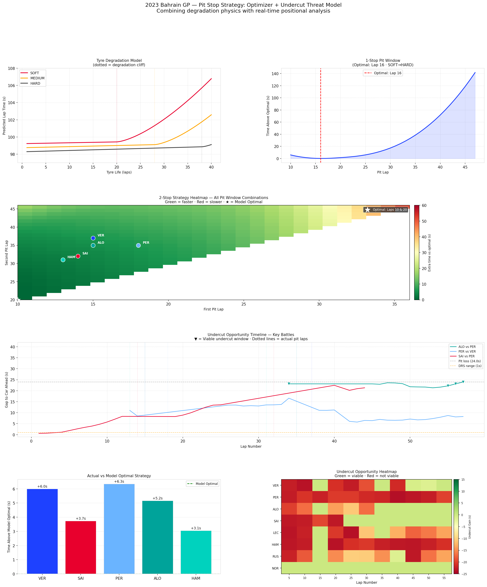

# F1 Pit Stop Strategy Optimizer + Undercut Threat Model

**2023 Bahrain GP · Dry Strategy Optimization · Wet Weather Analysis · Undercut Detection**



---

## Overview

This project builds two connected tools for F1 race strategy analysis:

1. **Pit Stop Strategy Optimizer** — simulates all possible pit window combinations using a physics-based tire degradation model to find the mathematically optimal strategy
2. **Undercut Threat Model** — uses real-time positional data and tire age to identify when a driver has a viable undercut opportunity against the car ahead

A third component analyses **wet weather strategy** across three races, with honest documentation of what the model can and cannot do.

---

## Results

### Dry Strategy Optimizer

| Strategy | Optimal Pit Lap(s) | Total Time |
|----------|-------------------|------------|
| 1-Stop (SOFT→HARD) | Lap 16 | 5,565.8s |
| 2-Stop (SOFT→MEDIUM→HARD) | Laps 10 & 20 | 5,590.1s |

**Model says 1-stop is 24s faster** — yet every top driver did 2-stop. This gap is explained by undercut threat dynamics (addressed below) and the risk of being stranded behind slower traffic on worn tires late in the race.

### Actual vs Model Optimal (2-Stop)

| Driver | Actual Pits | Time Above Model Optimal |
|--------|-------------|--------------------------|
| HAM | 13, 31 | +3.1s |
| SAI | 14, 32 | +3.7s |
| ALO | 15, 35 | +5.2s |
| VER | 15, 37 | +6.0s |
| PER | 18, 35 | +6.3s |

All drivers within 3–6 seconds of model optimal over a 57-lap race — **validating the model's core physics.** HAM/Mercedes made the most pace-optimal calls; PER/Red Bull prioritised strategic cover over pure pace.

### Undercut Threat Model

| Driver | Opportunities | Best Gain | Avg Gain |
|--------|--------------|-----------|----------|
| ALO | 14 | +4.93s | +2.19s |
| PER | 2 | +13.94s | +11.87s |
| SAI | 2 | +1.27s | +0.71s |

**ALO had 14 viable undercut opportunities against PER** in the final 15 laps — but with a 25s gap, the undercut gain (~4s) was insufficient to bridge that gap. This correctly explains why ALO never attempted the undercut despite having old tires.

**PER's best undercut window against VER** was at lap 35-36 (gap 34-38s, gain ~14s) — still insufficient, but the largest opportunity of the race. This aligns with the real race: PER was never close enough to VER to attempt an undercut.

---

## Key Findings

### The Pit Window Asymmetry
The 1-stop pit window is deeply asymmetric: pitting 2 laps early costs ~2s, but pitting 2 laps late costs ~8s. **Strategy engineers should always err early, never late.** Once tires fall off the degradation cliff (SOFT: lap 20, HARD: lap 38), lap time loss compounds exponentially.

### Why Real Teams Chose 2-Stop Despite 1-Stop Being Faster
The model shows 1-stop is 24s faster in pure pace terms. But all teams chose 2-stop because:
1. **Undercut threat**: a rival pitting early forces a response
2. **Traffic management**: a single long HARD stint risks being stuck behind a slower backmarker with no pace to overtake
3. **Safety car risk**: a longer stint increases exposure to a VSC/SC that erases the pace advantage

### Weather Model — Honest Assessment
The real-time model achieves F1=0.974 on training (Russian GP) and F1=1.000 on Japanese GP validation — but **Hungarian GP fails (F1=0.000)**. This is not a model bug. Hungary's evening cooling produced identical humidity/temperature patterns to rainfall. The `TrackAirGap` feature partially addresses this but cannot fully resolve it without multi-race training data.

**The model is best described as a wet condition severity classifier, not a forecast tool.** It quantifies *how wet* conditions currently are, and whether they're getting better or worse — directly useful for the decision of whether to switch from INTERMEDIATE to WET compound.

---

## Methodology

### Tire Degradation Model
Linear degradation baseline fitted via `scipy.optimize.curve_fit`, with an exponential cliff term applied after the compound-specific threshold (SOFT: lap 20, MEDIUM: lap 28, HARD: lap 38). Warm-up penalty applied to first two laps of each fresh stint.

### Pit Window Optimization
Exhaustive sweep of all valid pit lap combinations (minimum stint = 10 laps per F1 sporting regulations). 2-stop sweep: O(n²) over all valid first + second pit combinations.

### Undercut Threat Model
For each lap, each driver: compute cumulative race time gap to car directly ahead. If `tire_advantage - pit_loss + gap_to_ahead > 0`, undercut is mathematically viable. Tire advantage computed from compound degradation rate × current tyre life × projected stint length, minus fresh tire warm-up cost.

### Weather Features
Relative features (drop from session maximum, rise from session minimum) used instead of absolute values to normalize across different climate baselines. `TrackAirGap` feature added to separate rain cooling from diurnal cooling. Trained on 2021 Russian GP (dry→wet transition), validated on 2022 Japanese GP and 2021 Hungarian GP.

---

## How to Run

```bash
git clone https://github.com/YOUR_USERNAME/f1-strategy-optimizer.git
cd f1-strategy-optimizer
pip install -r requirements.txt
python analysis.py
```

---

## Project Structure

```
f1-strategy-optimizer/
├── analysis.py          # Full analysis: optimizer + undercut + weather
├── requirements.txt
├── README.md
├── f1_cache/            # Auto-created, gitignored
└── outputs/
    ├── bahrain_strategy_optimizer.png
    ├── wet_weather_strategy.png
    └── weather_pit_model_full.png
```

---


## Data Source

[FastF1](https://github.com/theOehrly/Fast-F1) — official F1 timing feed.
